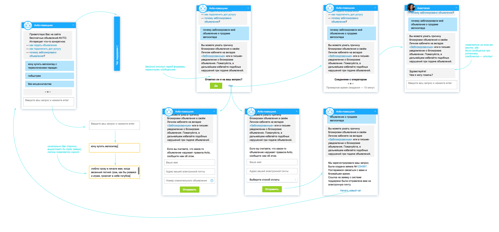

<iframe src="https://giphy.com/embed/l41lS8FYF9HUKHXu8" width="480" height="360" frameBorder="0" class="giphy-embed" allow="fullscreen"></iframe>

A little project that I've worked on in Avito in 2015. It was design for a first line of user support. The user can receive some answers on how the service works, file a complaint or request a chat with the live operator.

The user flow is pretty straightfoward. A few forms and help articles are shown upon the request (either by clicking a link in chat or entering the key word manually). If the form doesn't help a live operator chat can be requested.

