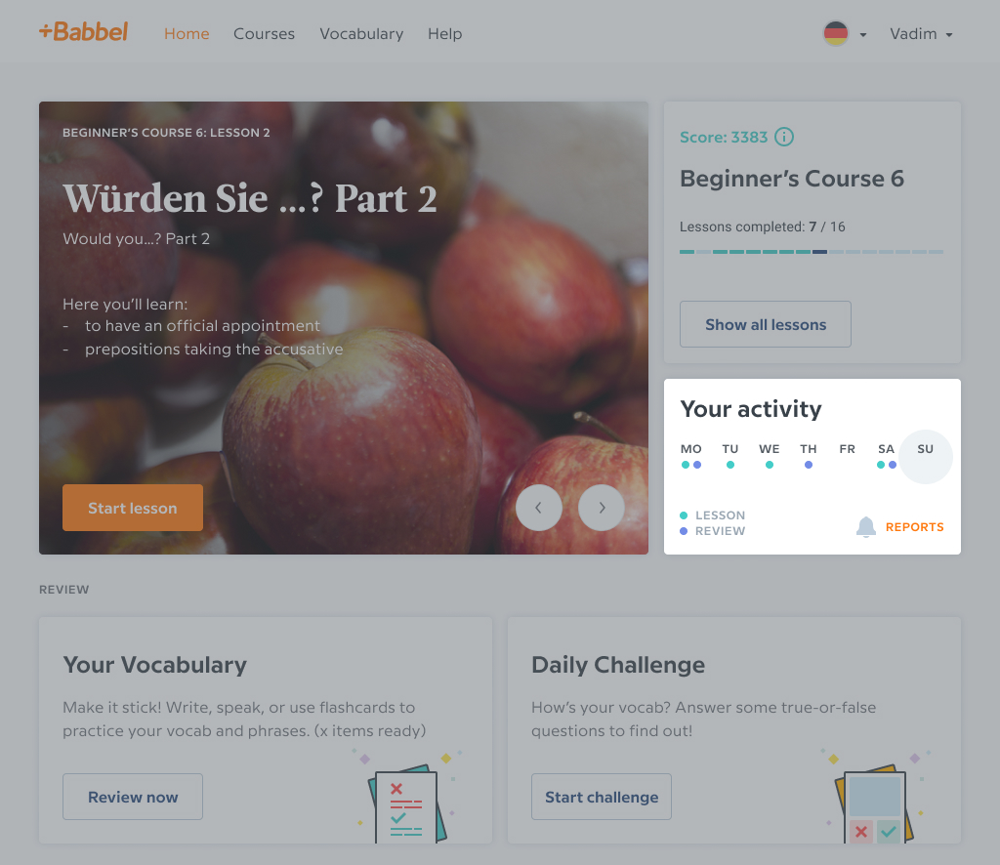
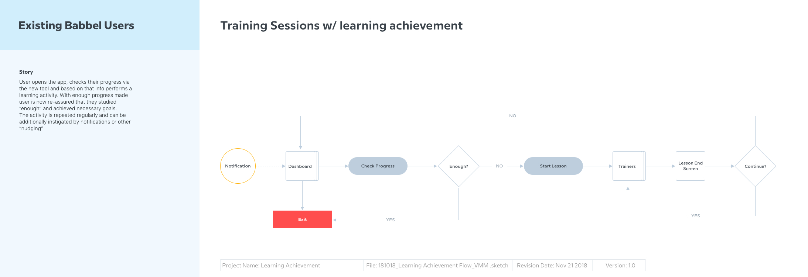
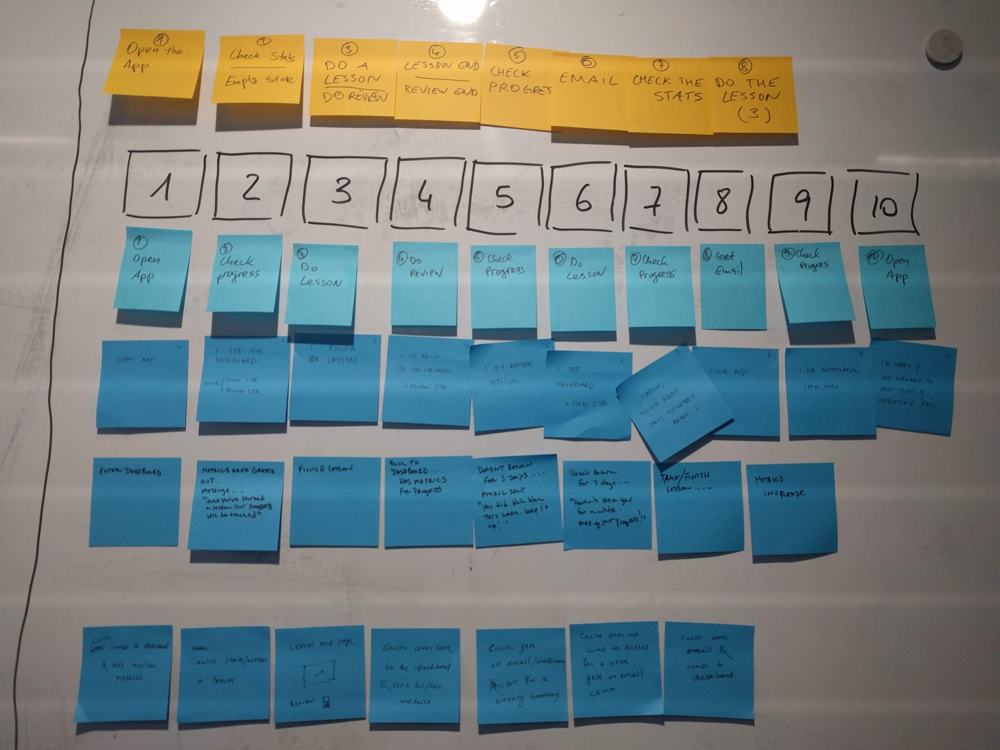
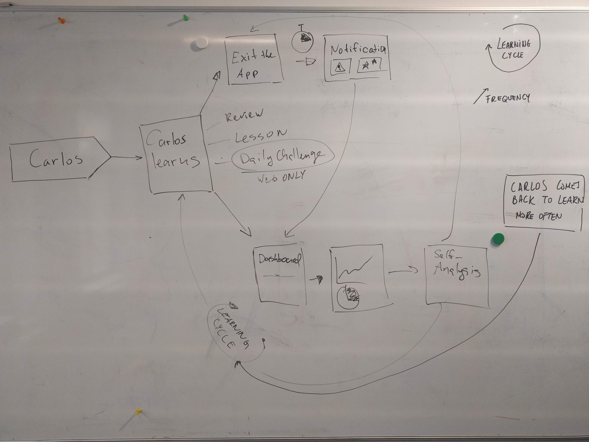
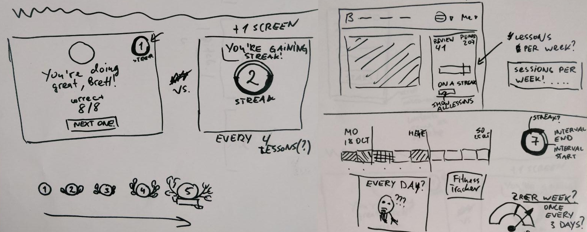
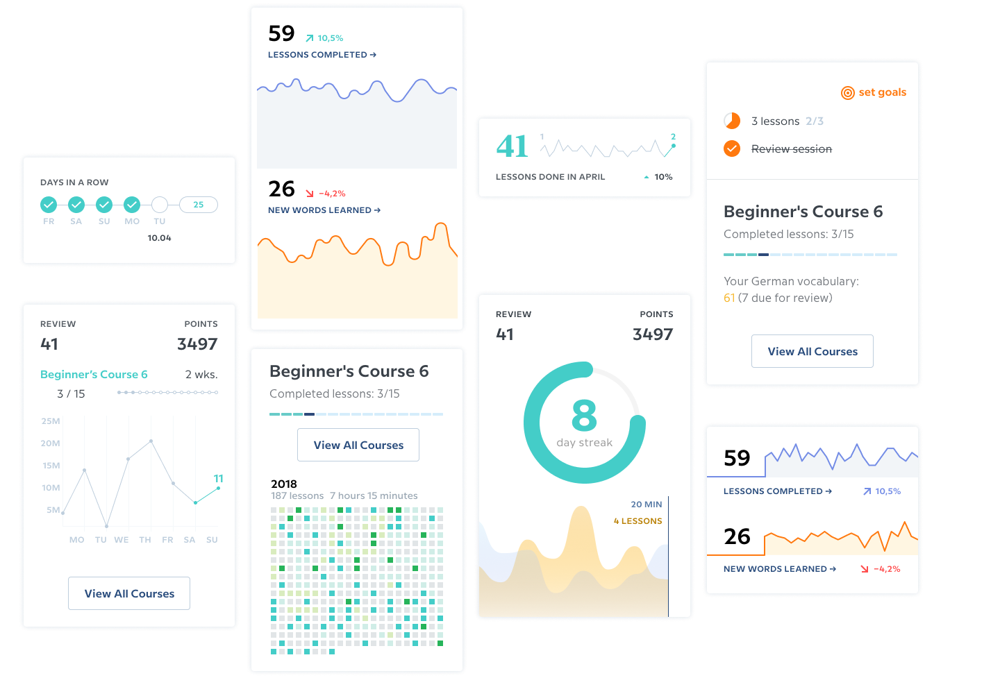
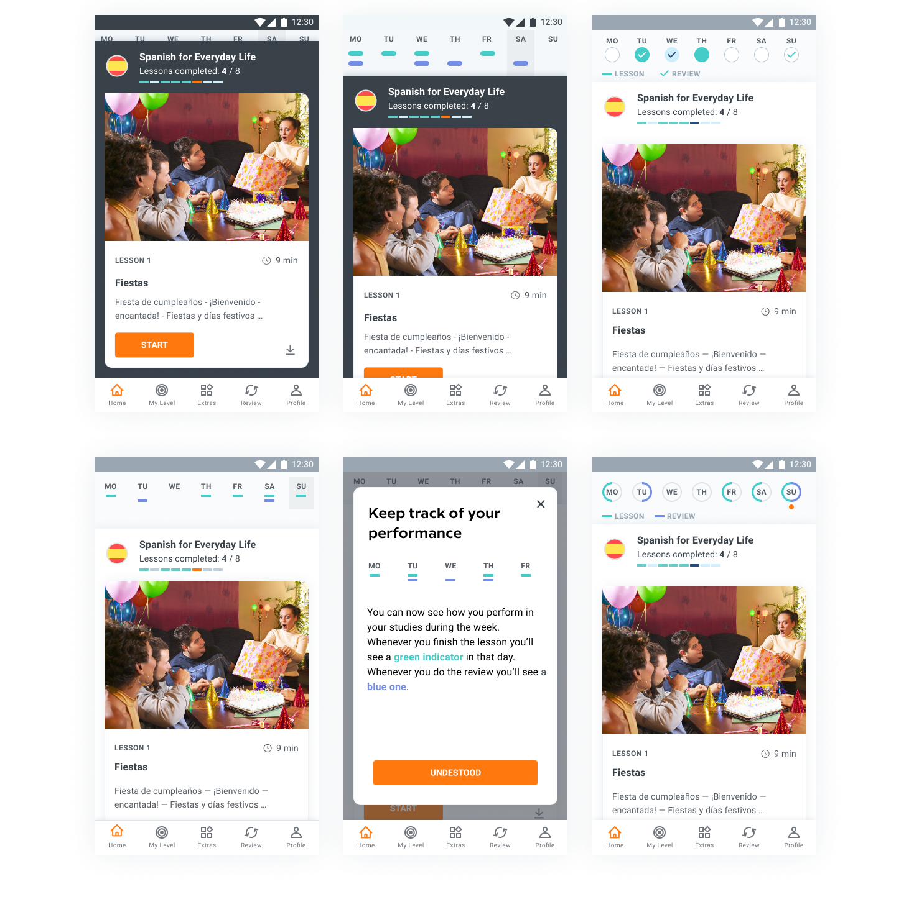
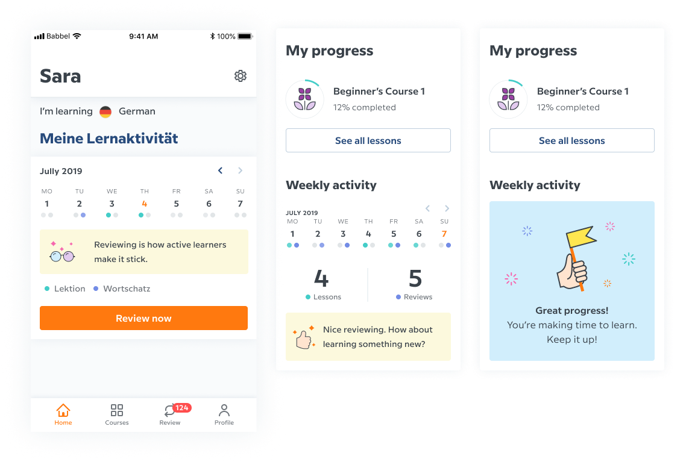

import LAMobilePrototype from "./lamobileprototype"

In Autumn 2018 while working at Babbel I was presented with a peculiar problem that long haunted our learners: loss of motivation. Language learning is a complex task that takes lots of effort and time. To be successful a learner needs to practice often. The sense of progression is minimal: language proficiency is one of the most complex skills to learn. It's not enough to grasp the basics and figure out the rules, one needs to practice those skills until using them doesn't require thinking on conscious level.

The flow that we wanted to achieve from implementing our feature was a simple repetitive pattern of practice. A little help for those learners who feel overwhelmed and start to fall behind on their studies.

We ran a cross-disciplinary (project management, development, instructional design, product marketing, product design) workshop to figure out the minimum viable solution that will achieve this goal. We used card sorting to figure out the steps of existing flow and point of impact where we can slightly adjust things to have more positive reinforcement.

Based on this exercise we used a whiteboard to map a more detailed user flow. We noted existing solutions, features that were being worked on in parallel and points of impact where we wanted to add something.

I sketched more detailed interface compositions for points of impact; got some quick feedback on what would be the easiest to implement but still meaningful for learners from participants of the work group who participated in the workshop.

I fleshed out more realistic digital mocks for the ideas we had on what would seem attractive, engaging and useful for our learners.

Prototype for qualitative user testing for mobile platform was done in Framer X. It represented very simplified used flow with certain degree of realism for the new features. Current date was always highlighted and learning data was generated randomly with new activity record being added at the end of the flow. We deployed it as a static website on AWS and sent the link to participants of qualitative testing to collect their feedback and thoughts on this new feature.

<LAMobilePrototype />

With more feedback I prepared the desktop prototype which was tested internally to iron out remaining questions about scope of first iteration that we wanted to deliver.

Team delivered the feature on desktop first. It was rolled out as an A/B test and after initial observation we registered uptick in the key metrics that we hoped would benefit from feature's presence in users' experience.

Because of this optimistic results the feature was rolled to mobile platforms too, and later was iterated on by my colleagues. Improved experience provided more data and included positive reinforcement messaging to drive those initial improvements for our metrics even higher.

