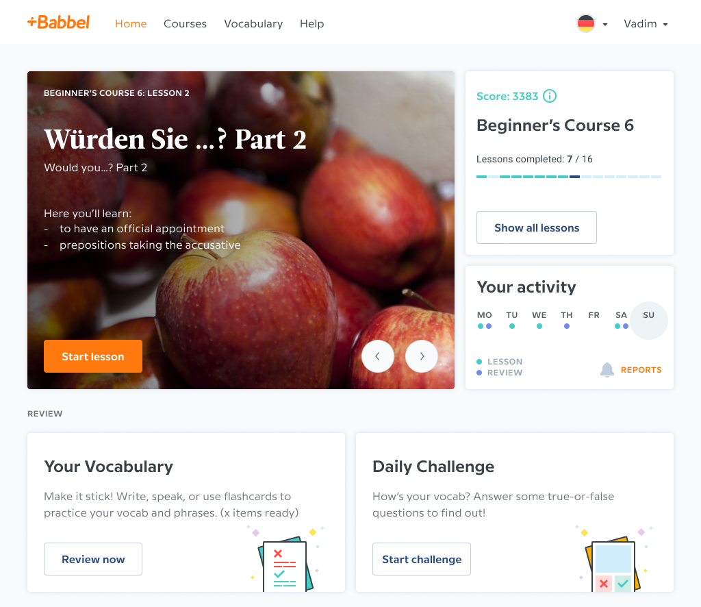

In Autumn 2018 while working at Babbel I was presented with a peculiar problem that long haunted our learners: loss of motivation. Language learning is a complex task that takes lots of effort and time. To be successful a learner needs to practice often. The sense of progression is minimal: language proficiency is one of the most complex skills to learn. It's not enough to grasp the basics and figure out the rules, one needs to practice those skills until using them doesn't require thinking on conscious level.

The flow that we wanted to achieve from doing our feature was a simple repetition pattern of practice.

