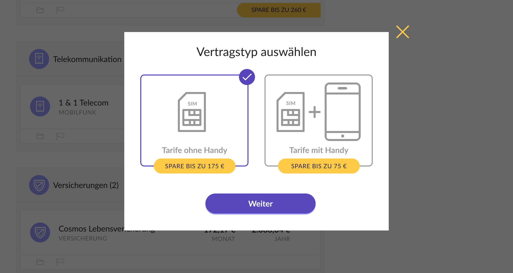
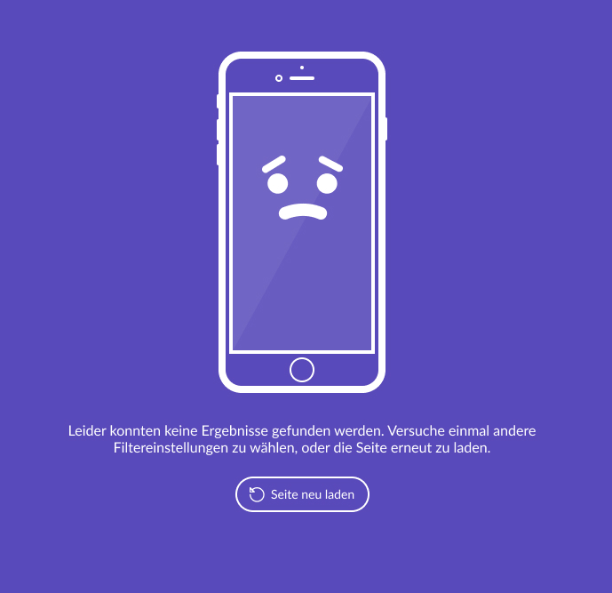
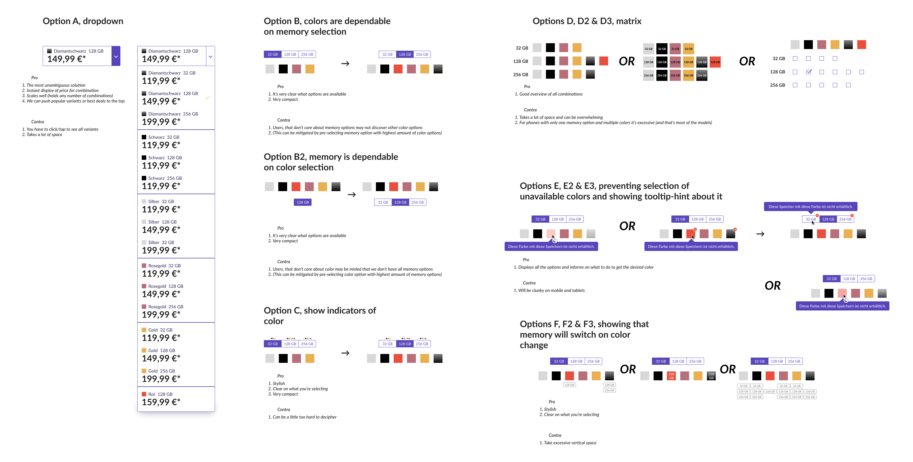

import Phonecard from "./phonecard"
import EnergyJourney from "./energyjourney"

After launching an MVP version of contract management tool in early 2017 MoneyMap discovered its first growth pains. The customer flow and offered service were nice and easy to use and company got quite a few satisfied first customers, but there was nothing for them to do after they switched their energy contracts. With only gas and electricity contracts MoneyMap's best bet was these satisfied customers returning in year to use the service once again.

<Phonecard />

Of course, there were already plans for more verticals to come. One of the most demanded and financially lucrative contract type were mobile phone contracts. The agreement with external party supplying MoneyMap with contract and deal data came through and the work on mobile vertical has started.

User flow for energy tariffs was quite straightforward from start to finish. The essence of it was just a basic choice scenario: “check out offers → select one”.

<EnergyJourney />

Telco space proved to be much more challenging. The linear user flow transformed into a pathway with branching: contracts with mobile phone and without one, going back and forth and picking up the best deal possible.

A great deal of effor went into finding best possible way to display all possible details for mobile phone models and tariffs.

Due to the large volume of offers additional filters had to be implemented. We've spent quite some time exploring possible guidance and helpful hints for the users.

Of course, there were also more trivial, but still very fun to work on stuff, such as an empty state for when your filtering produced no results.

The deeper into the woods we were getting the more potential gotchas for the users we were uncovering. A good example of such an edge case was the fact that not all memory capacity options were available in all colors. I spent some time exploring possible solutions to this problem…

In the end we settled on the most simple one and the easiest to implement without compromising the principle of being as helpful to the user as possible.

We launched the vertical in Autumn 2017 and started providing delightful experience of switching mobile contracts for our customers.
