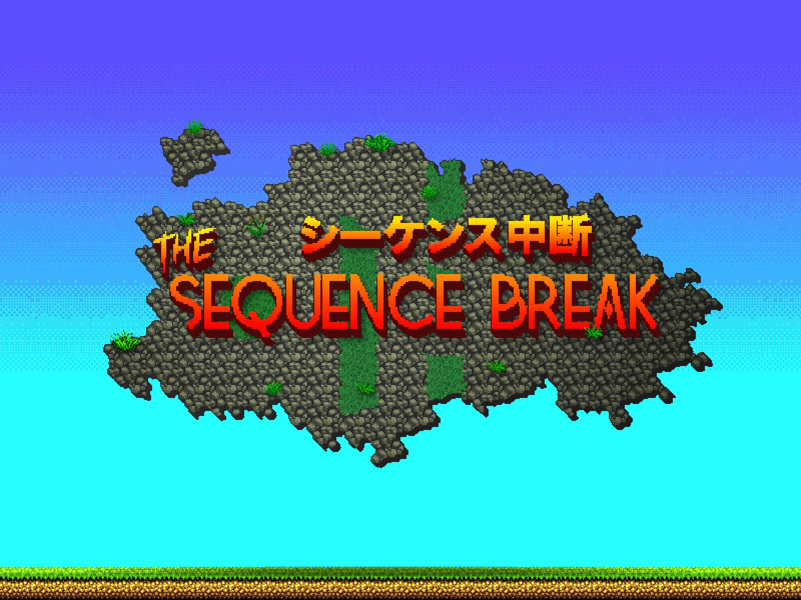
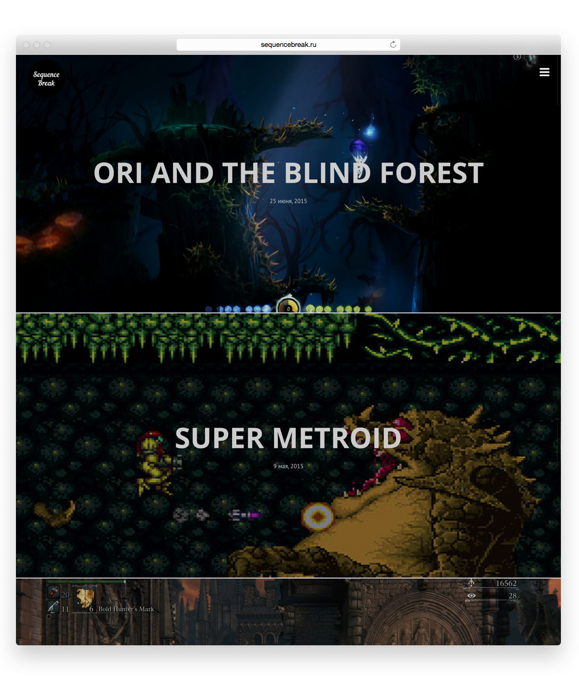
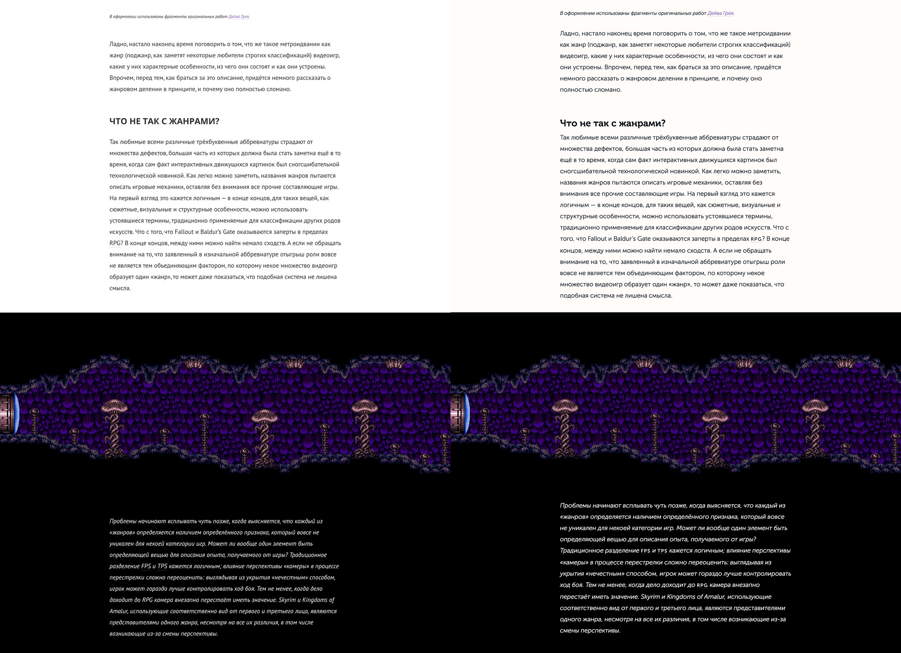
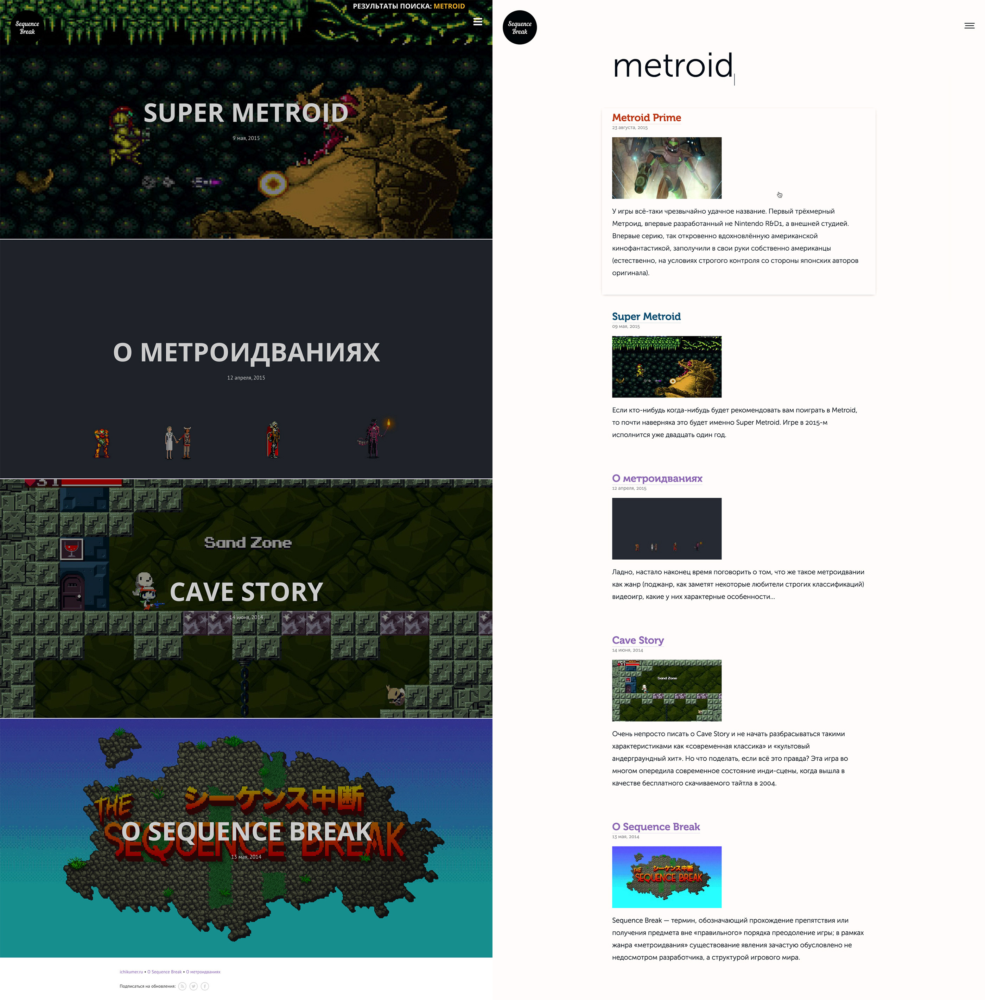

import Disclaimer from "./disclaimer"
import Sidebar from "./sidebar"
import Images from "./images"
import Mixblendmode from "./mixblendmode"
import Responsive from "./responsive"
import Textselection from "./textselection"

In May of 2014 I've launched a [site about metroidvanias](https://sqncbrk.com). It was a hasty launch with a lot of tinkering afterwards. A year later I've decided to remake it from scratch.

<Disclaimer>
  This case study describes creation of 2015–2016 version of SqncBrk that was
  live until early 2019 when I redesigned it once again. I urge you to read a{" "}
  <a href="/sqncbrk">case study</a> about that.
</Disclaimer>

Initial site used Wordpress as a backend with the Ink theme by [CodeStag](https://codestag.com). I've made a few tweaks and ended up making a rather extensive [child theme](https://github.com/ichik/Sequence-Break) for a task that was actually more of removing clutter, than adding stuff.

<Sidebar />

So I tuned the typography, changed and added some animations, moved a few things around a bit. And every time there was something in need of fixing I got that feeling of inner panic that I have when I see someone else's code and have no idea what's going on there. I'm not a stranger to stuff like HTML and CSS, I've written a few lines of code here and there. But there's a huge difference between making JS prototype and writing production code.

<Images />

That didn't stop me from adding fullscreen-width images (as seen above) to blog posts a few months before it became possible with a simple setting in original theme.

In May of 2014 I've ended up with something that was looking good, but was too much of a hassle to work with. There was still a lot to be done under the hood like removing the usage of Fontawesome (which is awesome, but too much of an overkill for a site with 3 icons).

I've started by making a basic [HTML-boilerplate](https://github.com/ichik/SqncBrk) for all 4 (and a half) templates the site was using. I've loosely copied the existing site layout and started polishing various layout elements in no particular order.

<Mixblendmode />

At the same time I was working on something you could have noticed on the previous image. I've always liked Museo, high-legible low-contrast geometric font with nice cyrillic glyphs.

Based on that fancy new search I've made a new template for search results differentiating it from the homepage and providing some text description for blog entries.

There was also a matter of adding proper responsive styling for nice layouts on mobile and tablet. With my own CSS in place it was much easier to do that hacking something on top of someone else's Wordpress theme.

<Responsive />

At some point I started thinking that it would be actually a good idea to look for a different backend. Instead of a highly complex and feature-heavy Wordpress I would've prefer something simple, fast and flexible. I was in need of CMS where really important things like server-side image resizing (for mobiles) were taken care of. And this backend also should've been flexible to add few things missing in the base package. I've ended up choosing flat-file [GRAV](https://getgrav.org) which is awesomely fast and extendable.

Since I have a very specific layout in mind, I wrote a plugin for my image output serving it just right with the help of [bLazy](https://github.com/dinbror/blazy/) library to do the lazy-loading.

<Textselection />

There's tons of small stuff like refined text selection highlight (seen above) or 404 page. And many things just seemed hard for me, but turned out to be quite easy when I approached them. Loading more items ended up being nothing more than a special template and 20 lines of JS.

You can't really stop trying to make something better. SqncBrk since then had numerous new blog entries, design improvements, and eventually was [redesigned fully](/sqncbrk) again.

