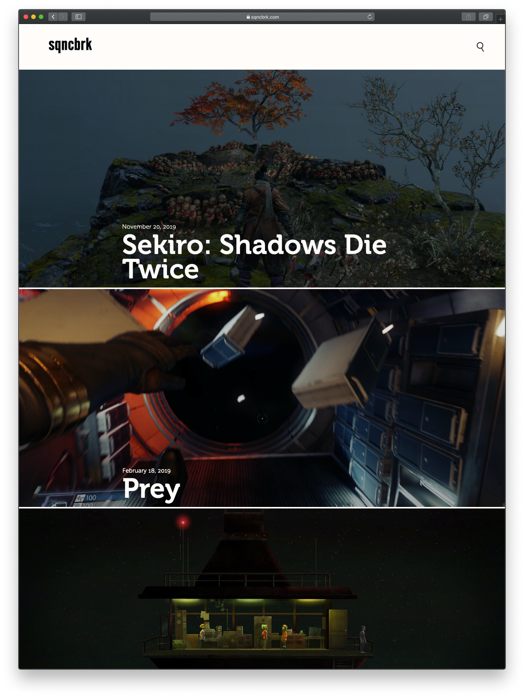
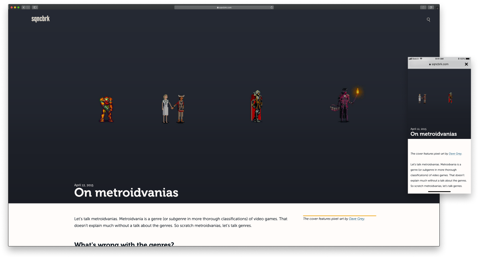
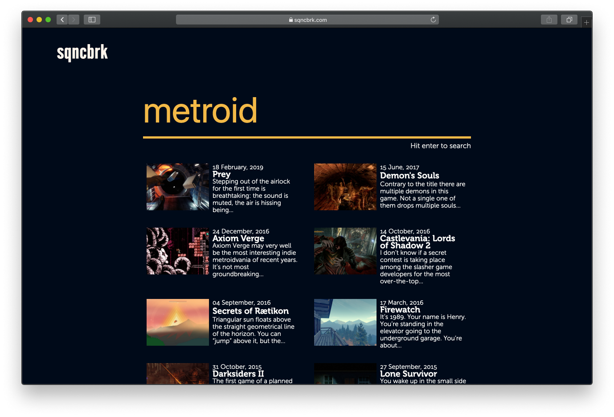
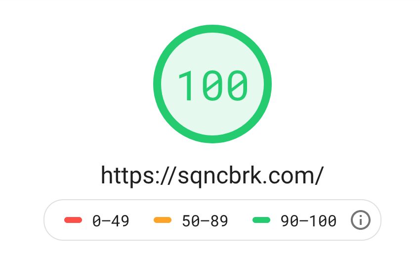

import Disclaimer from "./disclaimer"
import Newlogo from "./newlogo"
import Loadmore from "./loadmore"
import Search from "./search"
import Footer from "./footer"

<Disclaimer>
  This case study describes the most recent redesign of{" "}
  <a href="https://sqncbrk.com">SqncBrk</a>. The redesign of 2015–2016 is
  covered in a <a href="/sqncbrk-redux">separate study</a>.
</Disclaimer>

By late 2018 I hade a small list of UX issues, architectural issues and just general visual improvements that I wanted to introduce to a new version of SqncBrk. It was time for a big rewrite. Firstly, I wanted to part ways with old logo and set way for new glitchy branding reflecting updated vision for the project.

<Newlogo />

New tone was set by blocky Alternate Gothic Pro that was used to typeset the logo and glitch effect used for the hover. The “Load More” button got an appropriate matching hover style.

<Loadmore />

The general layout of the page was refined and re-done with CSS grid. The asymmetrical distribution of whitespace stayed, but the proportion of it and looks on big HD screens was fine-tuned to be less awkward. Mobile layouts were improved as well.

One of the best things to come out of this redesign was finally getting rid of [hamburger menu](https://en.wikipedia.org/wiki/Hamburger_button) which was there for the first two versions of SqncBrk. I always disliked it for all its UX shortcomings, but couldn't quite figure out how else to provide top-level links to two most important articles on the website ([About](https://sqncbrk.com/about/) and [On Metroidvanias](https://sqncbrk.com/metroidvanias/)). The solution was simply letting go of the idea of their importance and realizing that the key interaction in that menu was search which now was a key action. Links to the two articles were just attached to it as suggestions.

<Search />

Search results page was revamped to follow suit. Another minor accessibility fix that was introduced — a prompt on how to trigger search request right underneath the huge prominent search input.

The last piece of eye-candy was all new “slide-in” footer. It utilized the same grid as everything else and just a tiny bit of creative CSS for pleasant visual effect.

<Footer />

Performance of the site was also vastly improved with this rewrite. While it was good previosly, there were still a few things to improve. This time having more knowledge about optimization techniques and component-based CSS model I managed to achieve a [perfect score](https://developers.google.com/speed/pagespeed/insights/?url=https%3A%2F%2Fsqncbrk.com&tab=mobile) in Google's Pagespeed Insights. Fast loading time was a win for my readers as much as it was a reason to be proud of my developers' prowess.

