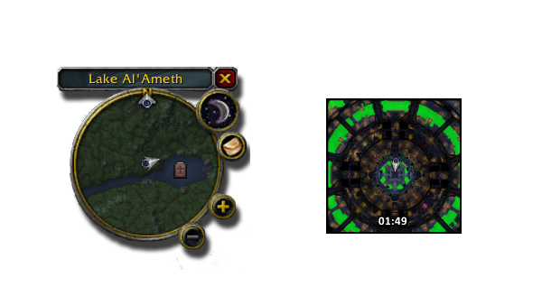
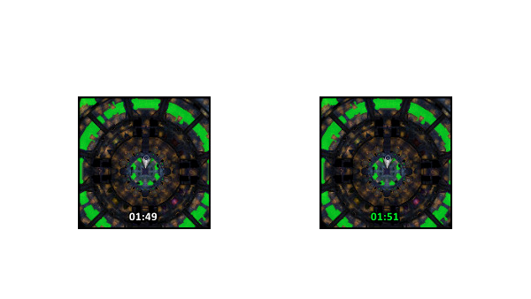
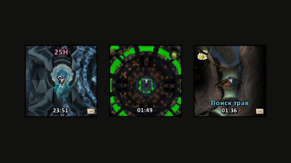
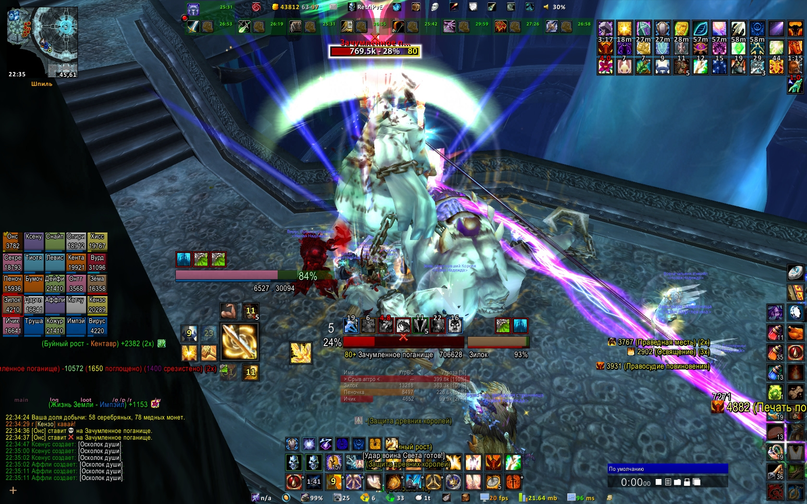
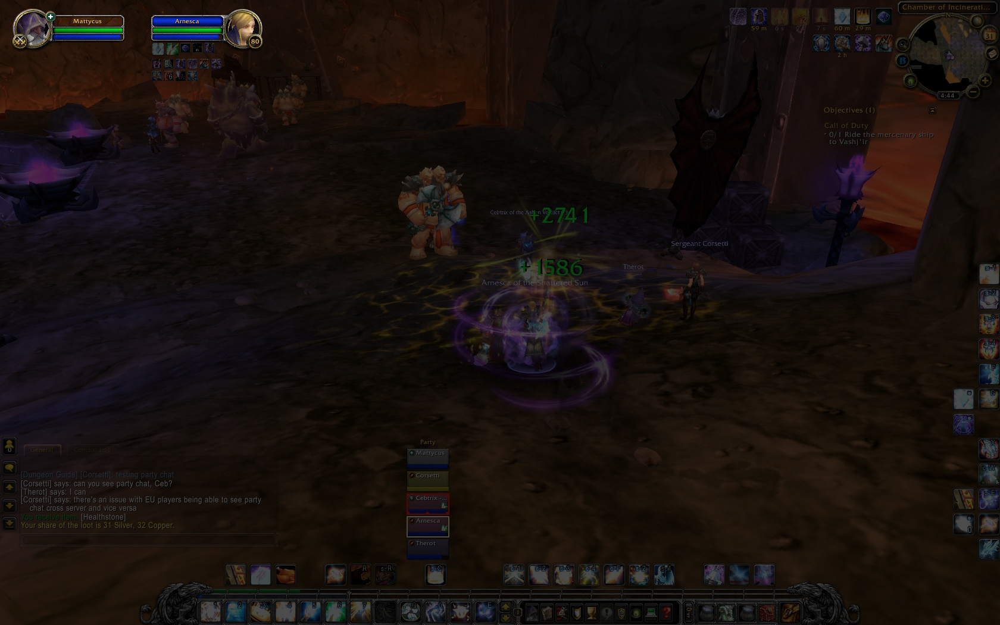
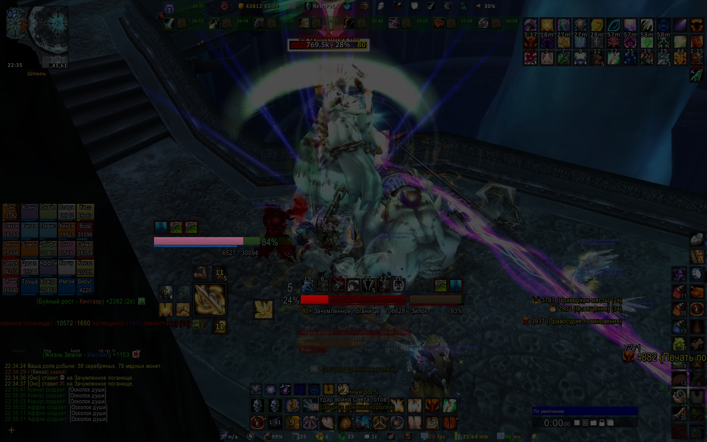
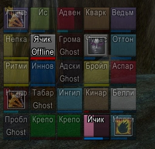
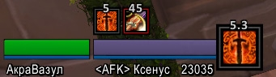

I've spent a fair amount of time playing World of Warcraft in the second half of the first decade of 2000s. It was a game that revolutionized massive multiplayer landscape. And it allowed to customize its UI with scripts written in [Lua language](<https://en.wikipedia.org/wiki/Lua_(programming_language)>).

The game exposed a bunch of methods and data in what I would call today an API. Back then it was just something I explored. I wasn't an experienced developer and my knowledge of UX design was more intuitive than practical or even theoretical. It was a fascinating experience: to adjust game's interface to a specific needs of end-game player.

I authored a few addons and shared some of them with other players through sites such as [WoWInterface](https://www.wowinterface.com/list.php?skinnerid=90053) and Curse Addons. I'd like to show a couple them as the earliest example of user interface work I did.

### Wanderlust

An addon for replacing standard WoW minimap. The default option can be quite busy and can be quite hard to “read” at a glance. Wanderlust removed most of the surrounding UI chrome and relied on very subtle indicators for conveying various information to the player.

One of the best examples of Wanderlust's design philosophy was this: whenever there was a pending invitation to join a group the color of the clock would turn green.

Other features of Wanderlust were square shape to show more of the map, text indicators for dungeon difficulty and a bunch of mouse gestures to control zoom, set timer, turning resource tracking on and off etc.

### oUF_ichik

A total customization for unit frames which was written on top of [oUF framework](https://github.com/oUF-wow/oUF/). oUF_ichik replaced all of the default frames of the standard WoW UI: player, target, pet, group, raid group etc.

Default WoW interface placed player's and target's healthbars in the top-left corner of a screen away from all the action making it quite difficult for me to monitor key indicators in the midst of chaotic virtual battle.

oUF_ichik moved these critical frames closer to the center of the screen. Player's frame was to the left of player's character. Target was directly below.

Other changes to default UI included things such as more legible text data that was not overlayed across the bars but rather was located underneath, specific highlights to despellable debuffs in raid groups, indication of visibility with semi-transparent mode for targets out of range and separated clearly visible cast bars.

One more thing of notice were enlarged buffs and debuffs specific to PVP gameplay that I started enjoying in late 2010. Having a grip on how long either of those was going to last was a key to many victories on arena.

