import Transition from "./transition"

It's always interesting to take a look at behind-the-scenes work. Public rarely gets to see those early concepts and sketches, but they form and shape future ideas and solutions, define direction for future work and sometimes contain impactful solutions that make their way to the final product.

This concept was produced in just 4 hours as a quick first iteration for a prospective client. It was based on the following brief: 

_Having full freedom, how would you envision a new chrome extension for ZenMate?! Imagine how you would display meaningful information and how you can improve the current flow from installation process up to first launch of the product._

### Quick view of the final results

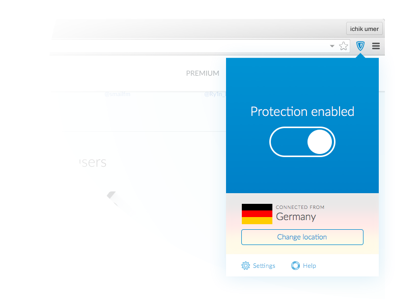

This is the key screen for the extension that I've settled with. It's simplistic and it solves the key task of the extension. “Users browse internet securely, privately and without restrictions.” This is my undestanding of the function which defines the form. That's just my undertanding, of course. I would've loved to get more input, and have actually prepared the list of questions that I would've asked were it my actual work task.

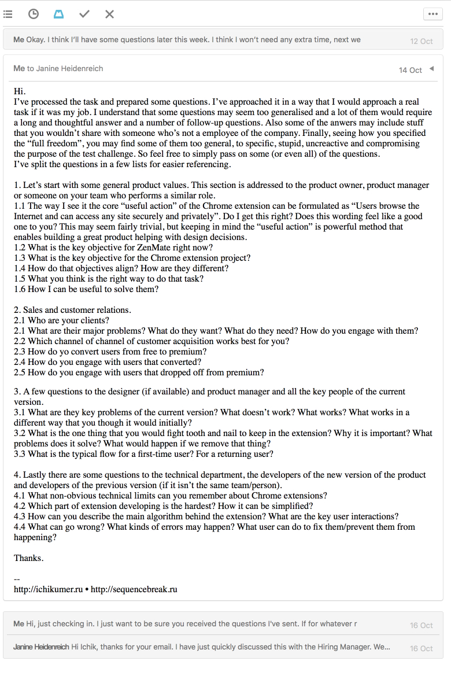

Every one of those questions could've changed the concept. Having more info, knowing restraints and overlooked advantages helps figuring out design solutions that would work. So, let's start from the beginning then.

### The Idea

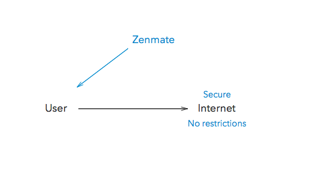

Above is a vepol of the core process. ZenMate helps users to browse internet securely, privately and without restrictions. I start with some quick sketching for the layout and user flow.

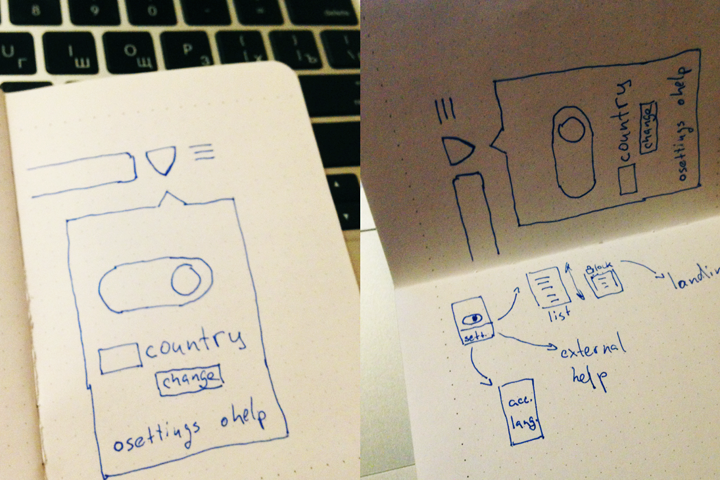

There's two drop-offs in the flow tying the extension to the ZenMate services. User gets access to free features right after the install process finishes. There's no requirement for registering — anonimity and security. We won't ask for anything like that before user tries to access the premium features. First we give him some value, then we can get something in return. User feels safe and values the service.

### The First Screen

Yes, it's the same that you've seen before. Now with a little bit more context. I decide to go with a full-colored background indicating the state of the connection. It captures the user focus and declares the main purpose of the extension.

For its counterpart I shortly consider the option of using deep red — the usual counterpart for blue.

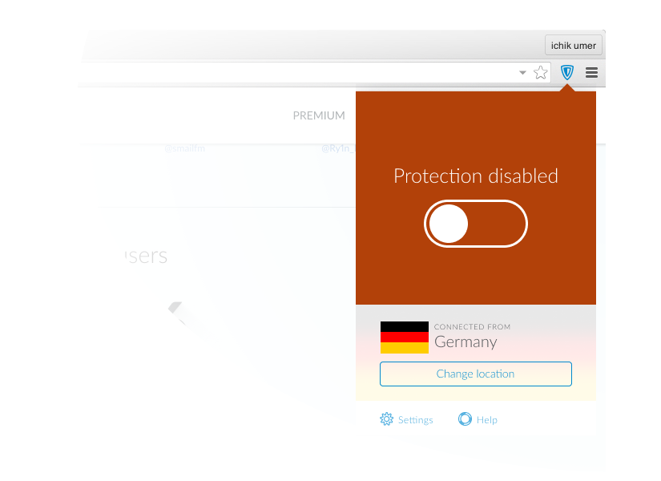

Too annoying, bright, would make everyday use of the extension less pleasant for the users that switch ZenMate on and off. Grey serves the same purpose of indicating off state and wouldn't be so irritating.

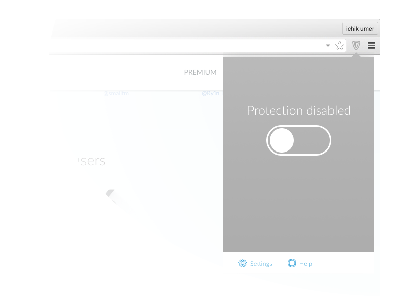

And since the location change doesn't make much sense when ZenMate is off, the colored background will cover it in this state. This state is actually the very first that user would see after installing extension. So turning it on should be something exciting, but not too overdone. A quick and meaningful transition.

<Transition />

### Location Selection Screen

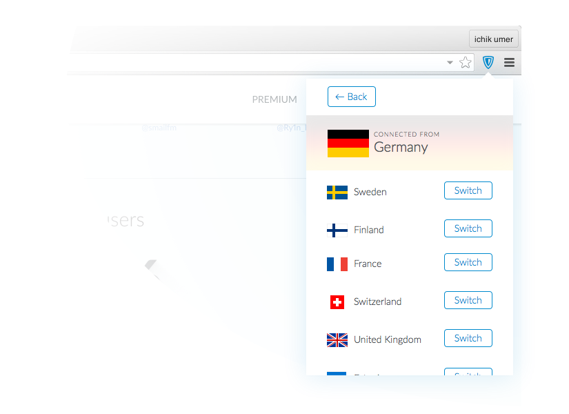

After the first few free options we offer some premium ones to the user. If the user is interested we take him to premium subscription landing.

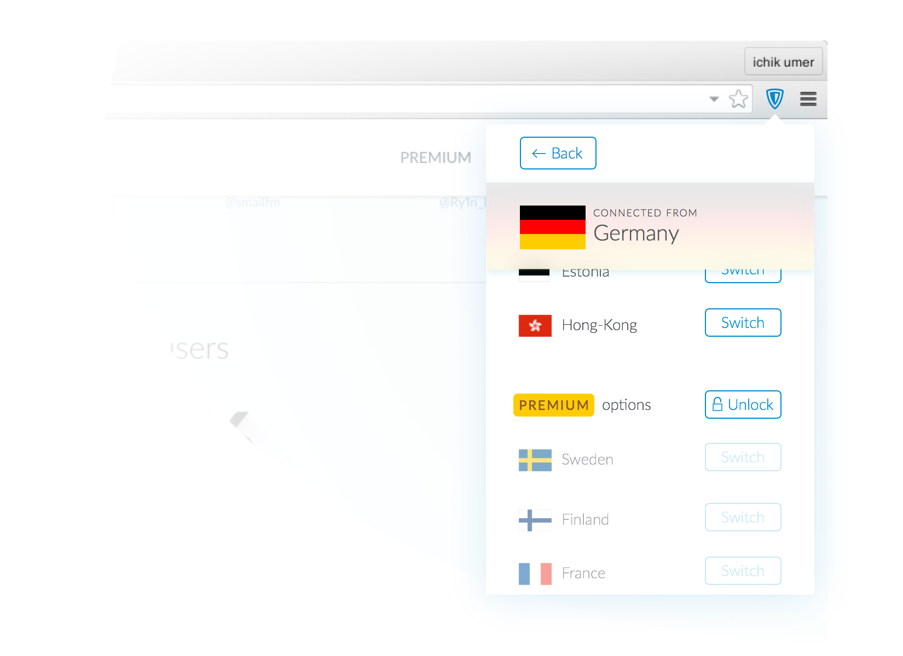

### Settings Screen

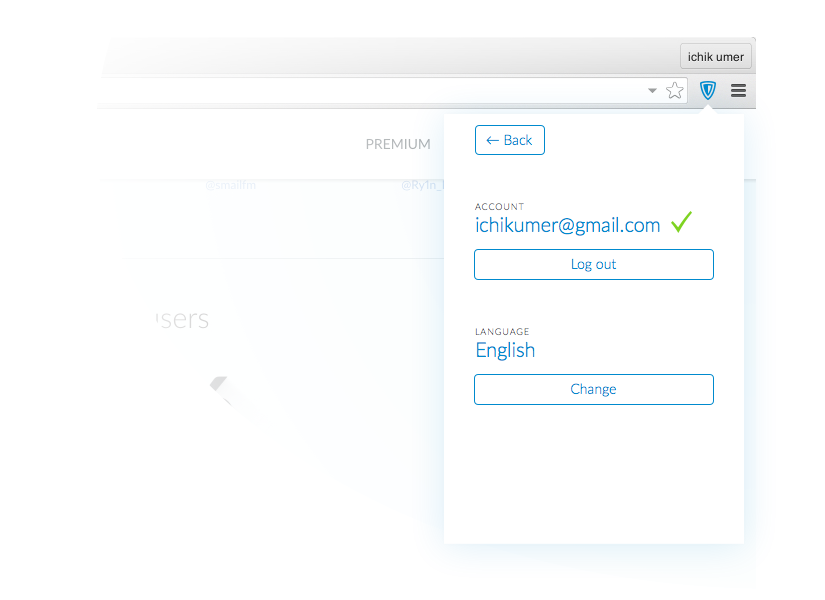

Of course, the first time user actually sees this screen he wouldn't be logged in. And he can have no account at all. And he may wish to have one, though it doesn't really imply any value to him here.

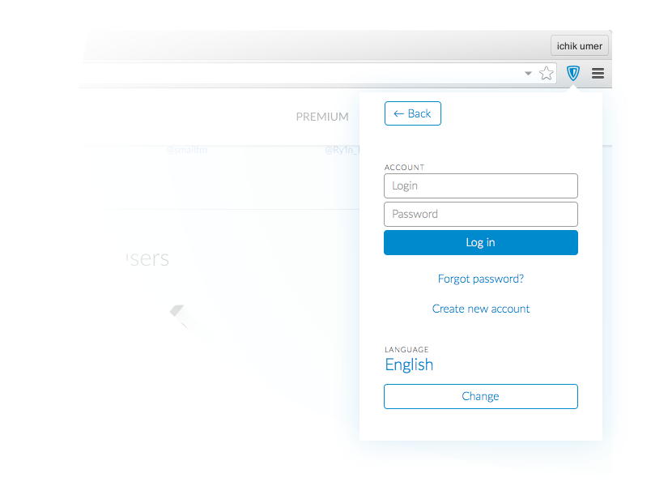

### User Flow Scheme

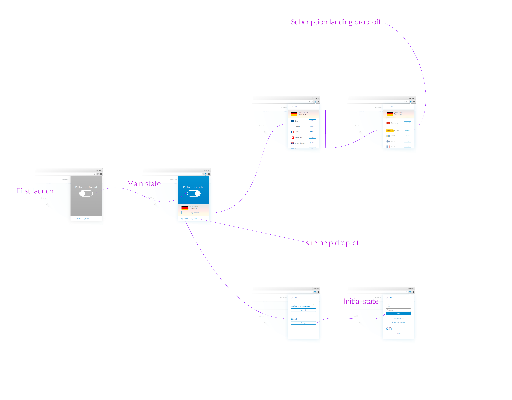

### Final Thoughts

The projects are usually envisioned like a straight line between points A and B. The truth is they are just planned so. This concept exists in a perfect world where it's required to solve only one problem. And even though it is the core problem, there are no doubt a lot of small ones, that I didn't uncover.