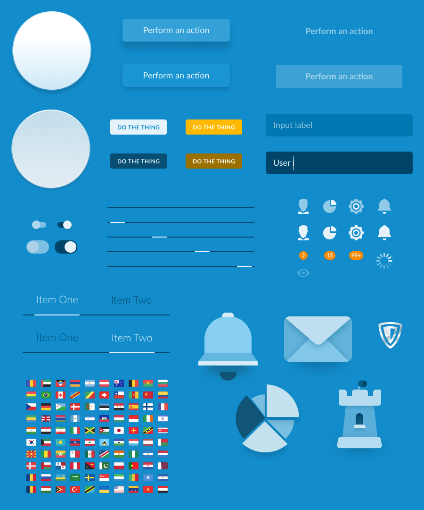
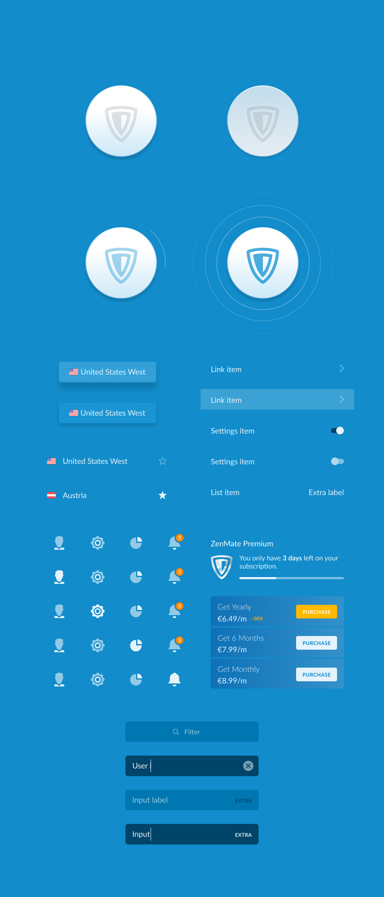
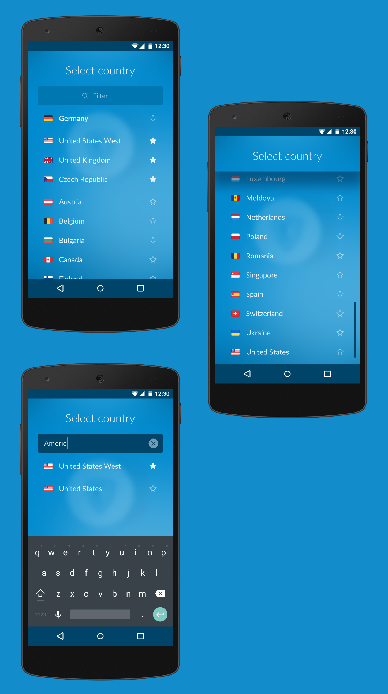
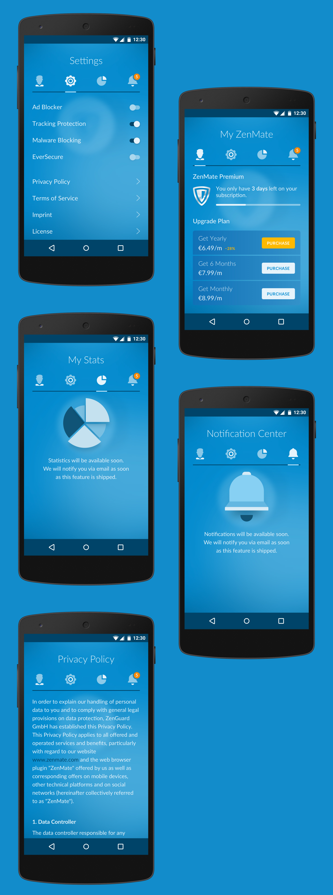
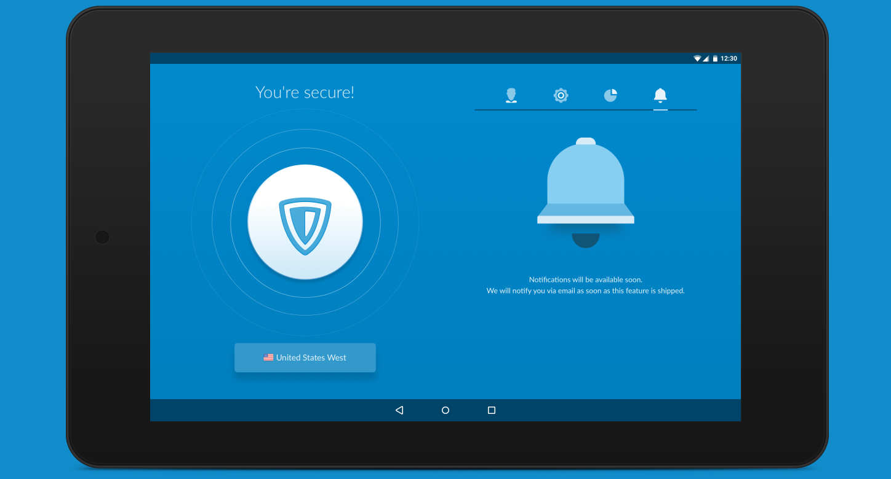

import Connection from "./connection"
import Screenreveal from "./screenreveal"

In 2016 I helped ZenMate to redesign their VPN client. Internally project was dubbed “Adele”. ZenMate had apps on all the major platforms (Windows, Mac, Android, iOS and browser extensions), but they for the most part looked nothing alike.

The goal was to unify all the apps in a single style, so that the service can be positioned as a universal solution that protects all your devices. I worked in a team with Jan Martin (art-director) and Peter Krämer (second designer). Primarily I authored the design system and layouts for Android.

### UI Kit

### Screens

Animation for establishing connection was <a href="./zenmateswitch/" target="_blank">prototyped in HTML</a> in an effort to speed up the development hand-off process. It turned out to be a complete success, since deriving values from CSS animation was much easier than relying on recording of animation and trying to make sense of easing curves that I used in the prototype.

<Connection />

Transition from homescreen to subscreens was prototyped in Principle. The rising “wave” animation accentuated the selected tab instead of opting out for universal animation for each screen.

<Screenreveal />

Tablets got special layout with subscreen content always present when you use the app.

