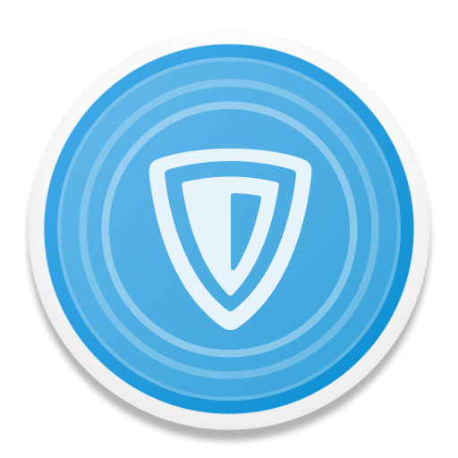
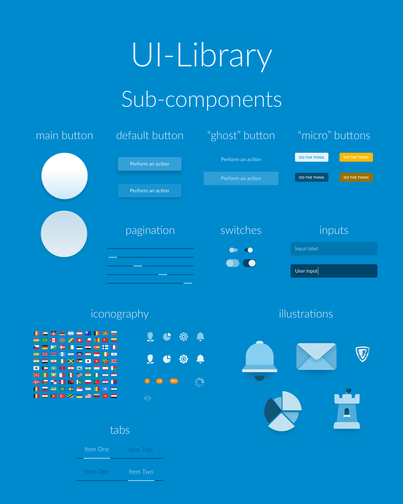
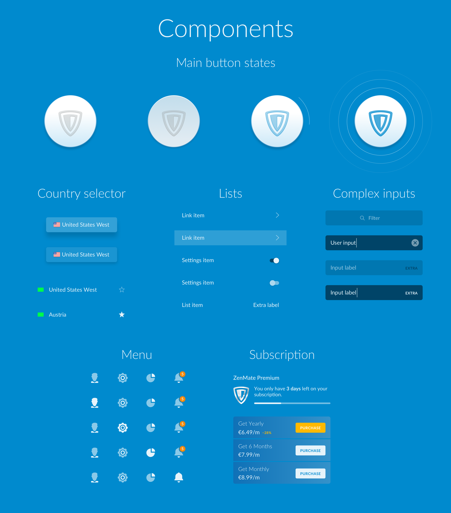
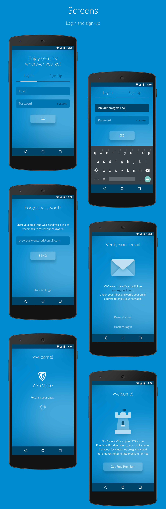
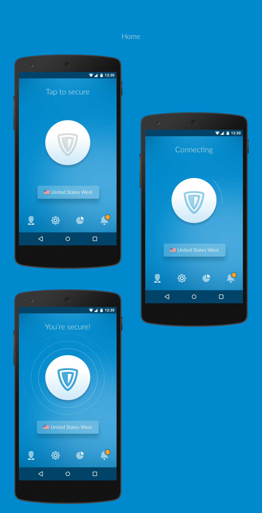
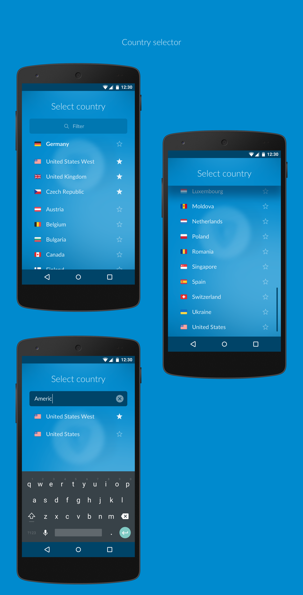
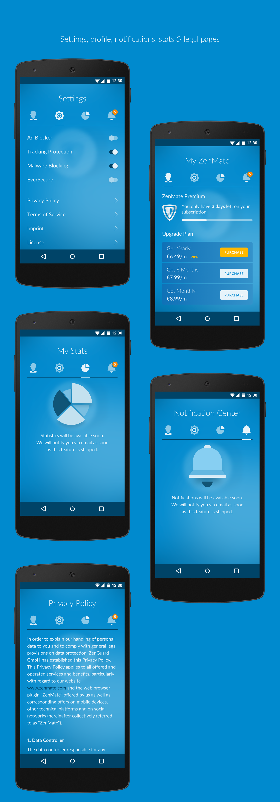
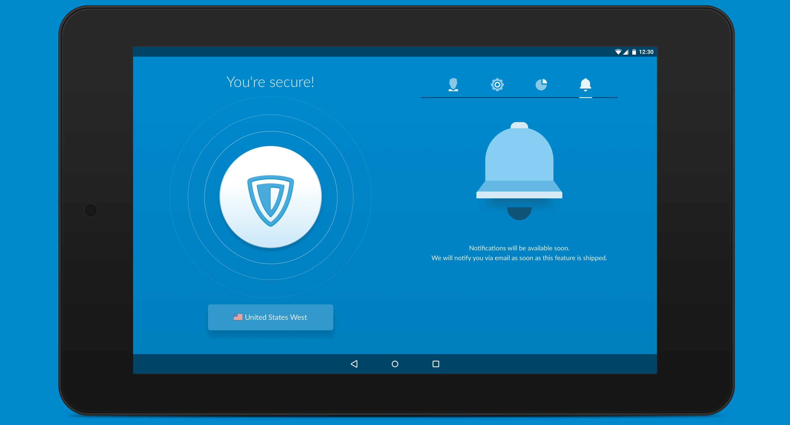

In 2016 I helped ZenMate to redesign their VPN client. Internally project was dubbed “Adele”. ZenMate had apps on all the major platforms (Windows, Mac, Android, iOS and browser extensions), but they for the most part looked nothing alike.

The goal was to unify all the apps in a single style, so that the service can be positioned as a universal solution that protects all your devices. I worked in team with Jan Martin (consulting art-director) and Peter Krämer (second designer). Primarily I authored the design system and layouts for Android.

When it came to creating animations, transition from homescreen to sub-screens was prototyped in Principle. The rising “wave” animation accentuated the selected tab instead of opting out for universal animation for each screen.

<iframe src="https://giphy.com/embed/13p7WFEGn4DZuw" width="270" height="480" frameBorder="0" class="giphy-embed" allow="fullscreen"></iframe>

Animation for establishing connection was <a href="./zenmateswitch/" target="_blank">prototyped in HTML</a> in an effort to speed up the development hand-off process. It turned out to be a complete success, since deriving values from CSS animation was much easier than relying on recording of Principle's animation and trying to make sense of easing curves that I used in the prototype.
    
<iframe src="https://player.vimeo.com/video/185475989" width="640" height="361" frameborder="0" webkitallow="fullscreen" mozallow="fullscreen" allow="fullscreen"></iframe>

Tablets got special layout with sub-screen content always present when you use the app.

